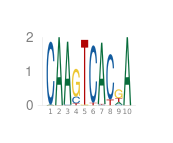
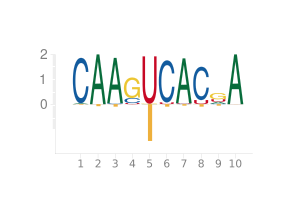

# PlotPWM

[](https://kchu25.github.io/PlotPWM.jl/stable/)
[](https://kchu25.github.io/PlotPWM.jl/dev/)
[](https://github.com/kchu25/PlotPWM.jl/actions/workflows/CI.yml?query=branch%3Amain)
[](https://codecov.io/gh/kchu25/PlotPWM.jl)


# Usage

## Plotting your typical PWMs
```
using PlotPWM

# Given a position frequency matrix (each column sums to 1)

pfm =  [0.01  1.0  0.98  0.0   0.0   0.0   0.98  0.0   0.18  1.0
        0.98  0.0  0.01  0.19  0.0   0.96  0.01  0.89  0.03  0.0
        0.0   0.0  0.0   0.77  0.01  0.0   0.0   0.0   0.56  0.0
        0.0   0.0  0.0   0.05  0.99  0.04  0.01  0.11  0.24  0.0]

logoplot(pfm)
```
will give



The function `logoplot(pfm)` produces a plot where:
- The x-axis shows the positions in the PWM. 
- The y-axis shows the information content (bits) for each position.

## Plotting your PWMs with crosslinking tendencies

The cross-linked PWMs not only display the PWM but also account for crosslinking tendencies, which is typically done for RNA-binding proteins (RBPs).

To achieve this, you'll need to estimate these tendencies alongside the PFM. For a PFM with $L$ columns, you'll provide a $K \times L$ matrix $C$, where $\sum_{k,\ell}C_{k\ell} = 1$.

For example, when $K=1$:
```
C = [0.01  0.04  0.05  0.0  0.74  0.05  0.03  0.05  0.03  0.0] 
```
You can then plot the cross-linked PWM using:

```
logoplotwithcrosslink(pfm, c; rna=true)
```
This will generate:




# Note

### Definition of Information Content in Position Weight Matrices (PWM)
In a position weight matrix (PWM), the "letter height", or more formally, the <b>information content</b> $IC(\cdot)$  of the $i$-th column $c_i$, quantifies how conserved the nucleotides are at that position compared to a background model. It is calculated using the formula:

$$
IC(c_i) = \sum_{\alpha}f_{\alpha i}\log_2 \frac{f_{\alpha i}}{\beta_\alpha}
$$

where 
- $f_{\alpha i}$ the frequency of nucleotide $\alpha\in\Set{A,C,G,T}$ at the $i$-th column of a PWM. 
- $\beta_\alpha$ denotes the genomic background frequency of nucleotide $\alpha$.

### Default genomic background
By default, the background model assumes a uniform distribution of nucleotides, with each nucleotide having a frequency of $\beta=(0.25, 0.25,0.25,0.25)$. In this case, the information content $IC(c_i)$ simplifies to:

$$IC(c_i)=2+\sum_{\alpha}f_{\alpha i}\log_2 f_{\alpha i}$$

This formula illustrates why the y-axis of the plot ranges from  $0$ to $2$.

## Acknowledgement
This code repo modifies the code using the awesome work from https://github.com/BenjaminDoran/LogoPlots.jl.